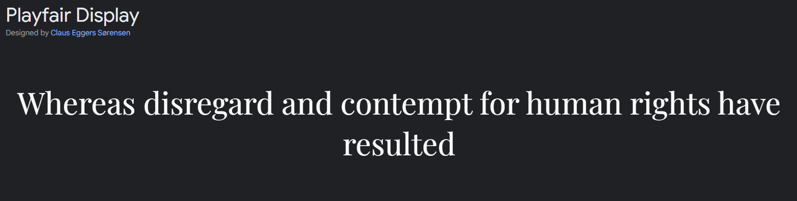

# Art Of Cooking

This is a simple recipe-sharing blog page where you can view different recipes to try out and share recipes to inspire others to try different food. On this blog page you can like a recipe so it is saved to your collection, leave comments, and share your recipes with others. The target audience for this page is anyone who loves cooking whether they're young or old.

The application has a full CRUD functionality where the user can Create, Read, Update and Delete recipes. Users can also leave comments to interact with a post. The comments need to be approved through the admin panel first to avoid any inappropriate comments. It is stored in a relational database management system.

 

Link to the [Live Site](https://the-art-of-cooking.herokuapp.com/)

---

## CONTENTS

* [User Experience](#user-experience-ux)
  * [Project Goals](#project-goals)
  * [User Stories](#user-stories)

* [Design](#design)
  * [Colour Scheme](#colour-scheme)
  * [Typography](#typography)
  * [Imagery](#imagery)
  * [Wireframes](#wireframes)

* [Features](#features)
  * [General Features on Each Page](#general-features-on-each-page)
  * [Future Implementations](#future-implementations)
  * [Accessibility](#accessibility)

* [Technologies Used](#technologies-used)
  * [Languages Used](#languages-used)
  * [Frameworks, Libraries & Programs Used](#frameworks-libraries--programs-used)

* [Deployment & Local Development](#deployment--local-development)
  * [Deployment](#deployment)
  * [Local Development](#local-development)
    * [How to Fork](#how-to-fork)
    * [How to Clone](#how-to-clone)

* [Testing](#testing)

* [Credits](#credits)
  * [Code Used](#code-used)
  * [Content](#content)
  * [Media](#media)
  * [Acknowledgments](#acknowledgments)

---

## User Experience (UX)
### Project Goals

The idea of this recipe blog page was to create a site where users can learn how to cook by viewing different recipes by other users. They can even share new recipes for other users to view. Users can also leave comments on recipes so they can share how they felt about them. This page is created for anyone who enjoy cooking and want to share their passion for cooking with other users.

The objective of this project was to create a fully functioning site using Python, HTML, CSS, JavaScript, and Django with full CRUD functionality. Agile methodologies were also used to plan for this project’s necessary features. I have also implemented an MVP with the necessary features for a good user experience. The site is responsive on small to large devices.

### User Stories
#### __Site Users Goals__

Users can use this site just to read recipes if they don’t wish to create an account. They can also see comments on the recipe but not share comments. If the user is logged in, they can share recipes, give it a like and interact with other posts. They can also create their own post and share it with others.
This project could be taken a step further by allowing users to search recipes by categories. We could have also provided links to the other similar recipes at the bottom of the page where they are viewing a recipe in certain category. 

#### __Site Owner Goals__

As a site owner, the goal is to let the user have fun while sharing recipes and interacting with others. Monitor the comments left by users to avoid rude and offensive comments being displayed. And also monitoring the posts. The goal is to make sure the site is on it’s theme and the posts are only cooking recipes related, accessible and appealing to new users. 

#### __First Time Visitor Goals__

As a first-time visitor, I would like to be able to:
- Understand what the purpose of the site is and what I can do on it without having to log in.
- Read recipes and their comments
- Navigate to the login/signup page if i want to become a user.

#### __Returning Visitor Goals__

As a returning registered user of the site I want to be able to:

- Log in to my account.
- Create, edit, delete and view my posts.
- Leave comments on posts.
- Like posts and save it to my liked collections.

## Design
### Color Scheme
- [Coolors](https://coolors.co/) - Coolors were used to decide on the colour scheme of this app. The colours were kept neutral so the background colours were not distracting the user from the recipe posts.

### Typography
- [Google Font](https://fonts.google.com/) was used to deceie on the fonts for this app. The two fonts used were [Fira Sans](https://fonts.google.com/specimen/Fira+Sans?query=Fira+Sans) and [Playfair Display](https://fonts.google.com/specimen/Playfair+Display?query=Pla).

### Imagery
- All the image for the page was taken from [Pexels](https://www.pexels.com/). The site images were kept simple and food related so the theme of the page is clear to the user.

### Wireframes
- All the wireframes were created using Balsamiq.

#### __Home Page__

#### __Saved Recipe Page__

#### __Share Recipe Page__

#### __Users Own Recipe Page__

## Technologies Used
### Languages Used
- HTML5 - This was used for the templates of the project and created a structure for the program
- CSS- CSS was used for styling the page and its elements.
- JavaScript- Provide frontend functionality and interactivity.
- Python- Python was used to create all the functions of that page.
- Git- Git was used for version control.

### Frameworks, Libraries & Programs Used
- Django- Python Framework
- Bootstrap- CSS and frontened framework
- [Balsamiq](https://balsamiq.com/)- Balsamiq was used to create the wireframes for this project.
- [Cloudinary](https://cloudinary.com/?&utm_campaign=1329&utm_content=instapagelogocta-selfservetest)- Cloudinary was used to store the images for this project.
- [Google Fonts](https://fonts.google.com/)- Google fonts was used to get the font style for this app.
- [Am I responsive](https://ui.dev/amiresponsive)- This was used to test the responsiveness of the site.
- [python-slugify](https://pypi.org/project/python-slugify) - Generates slug fields from unicode strings.
- [Summernote](https://pypi.org/project/django-summernote/) - A Django package that adds a text editor to text field so user can have more options to hoow their text is styled and displayed.