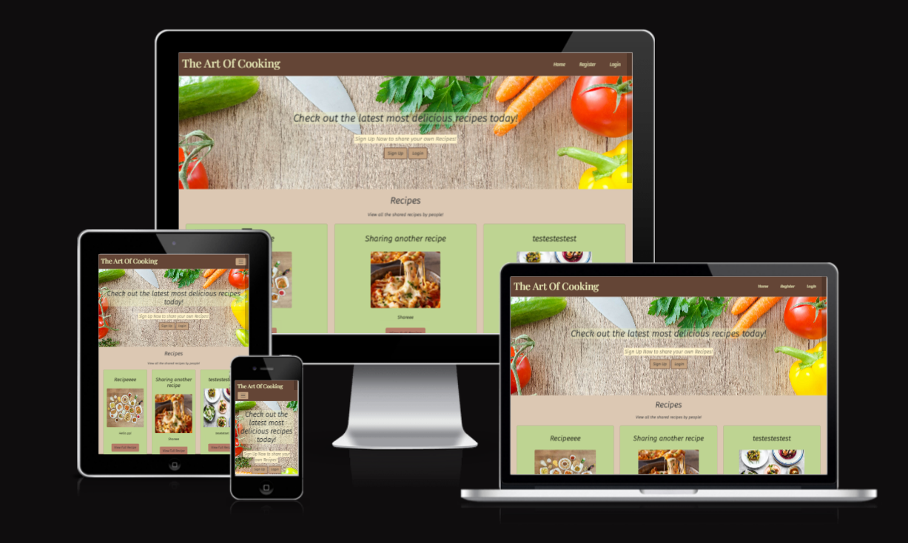

# Art Of Cooking

This is a simple recipe-sharing blog page where you can view different recipes to try out and share recipes to inspire others to try different food. On this blog page you can like a recipe so it is saved to your collection, leave comments, and share your recipes with others. The target audience for this page is anyone who loves cooking whether they're young or old.

The application has a full CRUD functionality where the user can Create, Read, Update and Delete recipes. Users can also leave comments to interact with a post. The comments need to be approved through the admin panel first to avoid any inappropriate comments. It is stored in a relational database management system.

 

Link to the [Live Site](https://the-art-of-cooking.herokuapp.com/)

---

## CONTENTS

* [User Experience](#user-experience-ux)
  * [Project Goals](#project-goals)
  * [User Stories](#user-stories)

* [Design](#design)
  * [Colour Scheme](#colour-scheme)
  * [Typography](#typography)
  * [Imagery](#imagery)
  * [Wireframes](#wireframes)

* [Features](#features)
  * [General Features on Each Page](#general-features-on-each-page)
  * [Future Implementations](#future-implementations)

* [Technologies Used](#technologies-used)
  * [Languages Used](#languages-used)
  * [Frameworks, Libraries & Programs Used](#frameworks-libraries--programs-used)

* [Deployment](#deployment)
  * [Deployment](#deployment)
  * [Local Development](#local-development)
    * [How to Fork](#how-to-fork)
    * [How to Clone](#how-to-clone)

* [Testing](#testing)

* [Credits](#credits)
  * [Code Used](#code-used)
  * [Content](#content)
  * [Media](#media)

---

## User Experience (UX)
### Project Goals

The idea of this recipe blog page was to create a site where users can learn how to cook by viewing different recipes by other users. They can even share new recipes for other users to view. Users can also leave comments on recipes so they can share how they felt about them. This page is created for anyone who enjoy cooking and want to share their passion for cooking with other users.

The objective of this project was to create a fully functioning site using Python, HTML, CSS, JavaScript, and Django with full CRUD functionality. Agile methodologies were also used to plan for this project’s necessary features. I have also implemented an MVP with the necessary features for a good user experience. The site is responsive on small to large devices.

### User Stories
#### __Site Users Goals__

Users can use this site just to read recipes if they don’t wish to create an account. They can also see comments on the recipe but not share comments. If the user is logged in, they can share recipes, give it a like and interact with other posts. They can also create their own post and share it with others.
This project could be taken a step further by allowing users to search recipes by categories. We could have also provided links to the other similar recipes at the bottom of the page where they are viewing a recipe in certain category. 

#### __Site Owner Goals__

As a site owner, the goal is to let the user have fun while sharing recipes and interacting with others. Monitor the comments left by users to avoid rude and offensive comments being displayed. And also monitoring the posts. The goal is to make sure the site is on it’s theme and the posts are only cooking recipes related, accessible and appealing to new users. 

#### __First Time Visitor Goals__

As a first-time visitor, I would like to be able to:
- Understand what the purpose of the site is and what I can do on it without having to log in.
- Read recipes and their comments
- Navigate to the login/signup page if i want to become a user.

#### __Returning Visitor Goals__

As a returning registered user of the site I want to be able to:

- Log in to my account.
- Create, edit, delete and view my posts.
- Leave comments on posts.
- Like posts and save it to my liked collections.


## Design
### Color Scheme
- [Coolors](https://coolors.co/) - Coolors were used to decide on the colour scheme of this app. The colours were kept neutral so the background colours were not distracting the user from the recipe posts.


### Typography
- [Google Font](https://fonts.google.com/) was used to deceie on the fonts for this app. The two fonts used were [Fira Sans](https://fonts.google.com/specimen/Fira+Sans?query=Fira+Sans) and [Playfair Display](https://fonts.google.com/specimen/Playfair+Display?query=Pla).


### Imagery
- All the image for the page was taken from [Pexels](https://www.pexels.com/). The site images were kept simple and food related so the theme of the page is clear to the user.

### Wireframes
- All the wireframes were created using Balsamiq. The below wireframes show the structure of all the pages as they are all similar.


## Features
### General Feature on Each Page
- Logged in Navbar
This Navbar is diplayed on all pages when the user is logged in

- Logged out Navbar
This Navbar is displayed on all pages when user is logged out.

- Footer
Footer is diaplayed on all pages


#### __Home Page__
- The home page displays 6 recipes and it can be viewed by anyone. If there are more than 6 recipes, a button is displayed at the bottom allowing the user to go to the next page to display more recipes. 


- If the user is logged out then the user is given different options than the above image.


### __View Recipe Page__
- The view recipe page is styled a bit differently just to make the displayed recipe look more interesting and fun.


- If the comment is submitted by the user, a small message is displayed informing the user that the comments need to be approved.


### __Share and Edit Recipe Page__
- Both the share recipe page and the edit recipe page have the same structure and layout to keep the styling of the page consistent. The form has differnt fields for user to fill in. There is also a text editor on the page so users can add styling to their text.


### __Saved Recipes__
- Users can like posts so they can view them later in their saved recipes. The saved recipe page has the same layout as the home page to keep the styling consistent.


### Future Implementations
In the future I would like to:
- Add a search bar on the home page so users can search for recipes they want to see.
- Give user the option to delete their account
- Allow user to change password or reset password.
- Allows user to manage their profile.

## Technologies Used
### Languages Used
- HTML5 - This was used for the templates of the project and created a structure for the program
- CSS- CSS was used for styling the page and its elements.
- JavaScript- Provide frontend functionality and interactivity.
- Python- Python was used to create all the functions of that page.
- Git- Git was used for version control.

### Frameworks, Libraries & Programs Used
- [Django](https://www.djangoproject.com/)- Python Framework
- [Bootstrap](https://getbootstrap.com/)- CSS and frontened framework
- [Balsamiq](https://balsamiq.com/)- Balsamiq was used to create the wireframes for this project.
- [Cloudinary](https://cloudinary.com/?&utm_campaign=1329&utm_content=instapagelogocta-selfservetest)- Cloudinary was used to store the images for this project.
- [Google Fonts](https://fonts.google.com/)- Google fonts was used to get the font style for this app.
- [Am I responsive](https://ui.dev/amiresponsive)- This was used to test the responsiveness of the site.
- [python-slugify](https://pypi.org/project/python-slugify) - Generates slug fields from unicode strings.
- [Summernote](https://pypi.org/project/django-summernote/) - A Django package that adds a text editor to text field so user can have more options to hoow their text is styled and displayed.

- - -

## Deployment
### Deployment
This site was deployed and hosted on [Heroku](https://www.heroku.com).

1. __Open your project in a code editor [GitPod](https://www.gitpod.io/) and make sure it is connected to a GitHub repo.__

2. __Install Django and supporting libraries__
- In the terminal type pip3 install 'django<4' gunicorn
- In the terminal type pip3 install dj_database_url psycopg2
- In the terminal type pip3 install dj3-cloudinary-storage

3. __Create a requirements file__
- type pip3 freeze --local > requirements.txt

4. __Create a Django project__
- In the terminal type django-admin startproject 'project_name' - project_name is desired project name

5. __Create app__
- In the terminal type python3 manage.py startapp 'app_name' - app_name is desired app name

6. __Add the new app into settings.py__
- In settings.py add the app name into the installed apps array variable and save the file

7. __Migrate Changes__
- In the terminal type python3 manage.py migrate
- To run the server: In the terminal type python3 manage.py runserver

8. __Create a new external database__
- Log into [ElephantSQL](https://www.elephantsql.com/) or create new account.
- Click to create new instance
- Set up the plan by giving it a name and select the tiny turtle plan (which is free)
- Select a region (data center) nearest to your location
- Click review, check that the details are correct and then click to create instance
- Return to ElephantSQL dashboard and click on the database instance name for the project
- Copy the ElephantSQL database URL using the copy icon. It begins with 'postgres://'

9. __Create the Heroku App__
- Log into [Heroku](https://www.heroku.com/) or create an account.
- Click to create new heroku app. Give the app an app name and select Europe as the region
- Open the app settings tab
- Click to reveal the config vars
- Add a config var called DATABASE_URL and paste in the ElephantSQL database URL

10. __Attach the database__
- In your code editor create a new env.py file.
- In the env.py file add import os at the top of the file
- Set environment variables inside the env file by adding - os.environ["DATABASE_URL"] = and then paste in the ElephantSQL database URL
- Set secret key variable inside the env file by adding - os.environ["SECRET_KEY"] = and then add your own secret key here. You can generate a secret key by going to [miniwebtool.com](https://miniwebtool.com/django-secret-key-generator/)
- In Heroku add the secret key variable value to the application config vars

11. __Prepare the environment and settings.py file__
- In settings.py reference and import the env.py by adding the following code to the file - 
from pathlib import Path
import os
import dj_database_url
if os.path.isfile("env.py"):
    import env
- Remove the hardcoded secret key and replace with links to the secret key variable in the env.py and heroku config vars by adding the following code - 
SECRET_KEY = os.environ.get('SECRET_KEY')
- Comment out the old DATABASES object variable and add a new databases variable by adding the following code - 
DATABASES = {
    'default':
    dj_database_url.parse(os.environ.get("DATABASE_URL"))
}

12. __Save all files and make migrations__
- In the terminal type python3 manage.py migrate

13. __Get static and media files stored on Cloudinary__
- Log in or sign up for an account on [Cloudinary](https://cloudinary.com/).
- Copy cloundinary URL API environment variable from Cloudinary dashboard
- Add cloudinary URL to env.py file by adding the following code - os.environ["CLOUDINARY_URL"] = and then paste in the Cloudinary URL
- In Heroku add in the Cloudinary URL into the application config vars on the app settings. The key should be CLOUDINARY_URL and the value should be the Cloudinary URL
- Add DISABLE_COLLECTSTATIC to Heroku config vars with a value of 1. This is a temporary step that will be removed on deployment
- Add Cloudinary libraries into installed apps in settings.py. To do this add the following code into the INSTALLED_APPS array variable - 'cloudinary_storage', 'cloudinary'. Cloudinary storage needs to be before django.contrib.staticfiles. Cloudinary needs to be after django.contrib.staticfiles.
- Tell Django to use Cloudinary to store media and static files by adding the following code into the settings.py file -
STATIC_URL = '/static/'
STATICFILES_STORAGE = 'cloudinary_storage.storage.StaticHashedCloudinaryStorage'
STATICFILES_DIRS = [os.path.join(BASE_DIR, 'static')]
STATIC_ROOT = os.path.join(BASE_DIR, 'staticfiles')
MEDIA_URL = '/media/' 
DEFAULT_FILE_STORAGE = 'cloudinary_storage.storage.MediaCloudinaryStorage'
- Link file to the templates directory in Heroku. Add the following code into the settings.py file under the BASE_DIR variable - 
TEMPLATES_DIR = os.path.join(BASE_DIR, 'templates')
- Change the templates directory to templates_dir. To do this add the following code inside the templates array variable -
'DIRS':[TEMPLATES_DIR],
- Add Heroku hostname to allowed_hosts by adding the following code into the allowed hosts variable - ["project_name.herokuapp.com", "localhost"] - project_name is the project name
- Create three new folders in top level of project directory - media, static and templates

14. __Create Procfile__
- Create a file called Procfile on the top level of the project directory
- Add the following code into the procfile - web: gunicorn project_name.wsgi - project_name is the project name
- Save all files

15. __Add, commit and push to repo__
- In the terminal type the following commands to push to the GitHub repo -
git add
git commit -m "Deployment commit"
git push

16. __Deploy the project to Heroku from the GitHub repo__
- On the Heroku project add another config var - the key should be PORT and the value should be 8000
- Under the project deploy tab, for the deployment method select GitHub. Search for the repository name and click connect. Once the project is connected scroll down to the manual deployment section and click deploy branch. Make sure you have the main branch selected

### Local Development

#### __How to Fork__

To fork the repository:

1. Login (or sign up) to Github.

2. Go to the repository for this project, [Art Of Cooking](https://github.com/fatimaqais/art-of-cooking).

3. Click the Fork button in the top right corner.

#### __How to Clone__

To clone the repository:

1. Login (or sign up) to GitHub.

2. Go to the repository for this project, [Art of Cooking](https://github.com/fatimaqais/art-of-cooking).

3. Click on the code button, select whether you would like to clone with HTTPS, SSH or GitHub CLI and copy the link shown.

4. Open the terminal in your code editor and change the current working directory to the location you want to use for the cloned directory.

5. Type the following command in the terminal (after the git clone you will need to paste the link you copied in step 3 above):

    ```bash
    git clone { & THE LINK FROM STEP 3 }
    ```

6. Set up a virtual environment (this step is not required if you are using the Code Institute Template in GitPod as this will already be set up for you).

7. Install the packages from the requirements.txt file by running the following command in the Terminal:

    ```bash
    pip3 install -r requirements.txt
    ```

- - -

## Testing

To view all the testing done for this page, [Testing.md](TESTING.md)

## Credits
### Code
- Some of the code for the view file were inspired by the [Codemy.com](https://www.youtube.com/playlist?list=PLCC34OHNcOtr025c1kHSPrnP18YPB-NFi) youtube blog guide.
- The README file guide was taken from [Kera Cudmore](https://github.com/kera-cudmore).

### Content
Content for this page was created by Fatima. The recipes are a sample recipe to show examples of how the site works.

### Media
- Most images were taken from [Pexels](https://www.pexels.com/)
- Icons were taken from [Font Awesome](https://fontawesome.com/)