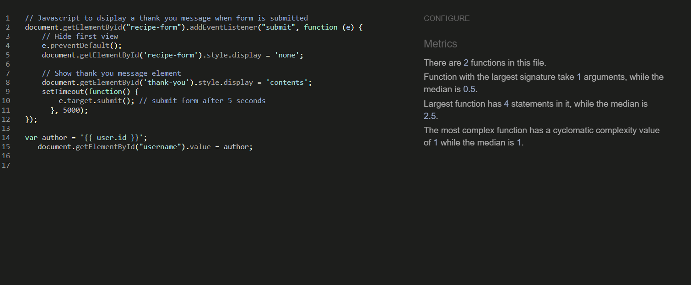

# The Art Of Cooking - Testing

Visit the deployed site: [The Art of Cooking](https://the-art-of-cooking.herokuapp.com/)

- - -

## CONTENTS

* [AUTOMATED TESTING](#automated-testing)
  * [W3C Validator](#w3c-validator)
  * [JavaScript Validator](#javascript-validator)
  * [Python Validator](#python-validator)
  * [Lighthouse](#lighthouse)
* [MANUAL TESTING](#manual-testing)
  * [Testing User Stories](#testing-user-stories)
  * [Full Testing](#full-testing)
* [BUGS](#bugs)
  * [Solved Bugs](#solved-bugs)
  * [Known Bugs](#known-bugs)

During development I made use of Google Chrome Developer Tools to ensure everything was working correctly and to assist with troubleshooting when things were not working as expected. I have gone through each page using Google Chrome Developer Tools to ensure that each page is responsive on a variety of different screen sizes and devices.

- - -

## Automated Testing
### W3C Valiadtor

[W3C Validator](https://validator.w3.org/#validate_by_uri) was used to valiadte the the HTML pages and the CSS for the site.

- I saw some errors for the html page which was related aria labels being used on non-interactive tags and an error was for the button tag surronding "a" tags. This was fixed and after that, no erorrs were found.
- [W3C HTML](https://validator.w3.org/nu/?doc=https%3A%2F%2Fthe-art-of-cooking.herokuapp.com%2F) - No errors were found.

- There were no errors when testing for CSS

- - -

### JavaScript Validator
[JSHint](https://jshint.com/) to validate JavaScript. No errors were found.

- - -

### Python Validator

[Code Institue Python Linter](https://pep8ci.herokuapp.com/) was used to test for errors in python files.
#### __views.py__

#### __urls.py__

#### __models.py__

#### __forms.py__

#### __admin.py__

### Lighthouse
- Home Page

- User Recipe Page

- Saved Recipe Page

- - -

## Manual Testing
### Testing User Stories

| Goals | How are they achieved? |
| :--- | :--- | 
| `First Time Visitors` |
|  |  |  |
| Understand what the site is for and how to navigate the site. | An image on the site to give an idea of what the pageis for. A heading to explain what the user can do on the page. | 
| Register for an account. | The user should see clear optiona t the top of the page to register for an account so they know they can sign up for an account |
| View Recipes shared for public | Users can view recipes and read it so the site is not useless for first-time users and if they don't have an account |
|`Returning Visitor`|  |  |
| Log in to my account | If a user is not logged into an account, a login link is provided on the navbar. | 
| Create a recipe | The user can create a new recipe to share with other users. |
| Like a recipe | User can like a recipe when logged in. This will save the recipe for them to view later |
| Delete and edit recipe | User should be able to edit and delete only their own recipe |
| Leave a comment | Users should be able to leave a comment on the recipe and wait for it to get approved |
|`Admin User` |
|  |  |  |
| Remove any comments that are offensive | Admin should be able to approve or delete any comments if they are offensive  |

### Full Testing 
| Feature | Expected Outcome | Testing Performed | Result | Pass/Fail |
| --- | --- | --- | --- | --- |
| `Navbar` |
|  |  |  |  |  |
| Name of the page | When clicked the user will be redirected to the home page. | Clicked title | Redirected to the home page. | Pass |
| Home Page (All users) | When clicked the user will be taken to the main page with all recipes. | Clicked link | Redirected to the home page | Pass |
| Log in Link (Shown to users not signed in) | When clicked the user will be redirected to the log in page. | Clicked link | Redirected to the log in page | Pass |
| Register Link (Shown to users not signed in) | When clicked the user will be redirected to the register page. | Clicked link | Redirected to the register page  | Pass |
| Log out Link (Logged in users only) | When clicked the user will be redirected to the home page with the sign in options diplaying again | Clicked link |Redirected to the home page with signin and register options | Pass |
| `Footer` |
|  |  |  |  |  |
| Linkedin Icon | Shows the Linkedin icon and allows the user to click on it and redirect them to Linkedin | Clicked Link | Opens a new tab and takes them to the correct link | Pass |
| GitHub Icon | Shows the GitHub icon and allows the user to click on it and redirect them to the GitHub profile | Clicked Link | Opens a new tab and takes them to the correct link | Pass |
| `Home Page` |
|   |   |   |   |
| Recipe Posts Shared by all users | When clicked the user will be able to view the full recipe. | Clicked link  | Opens full details of the recipe. | Pass |
| Page Pagination | Allows the user to go to the next page when more than 6 recipes are available. | Clicked link | Takes the user to next page to view more recipe posts | Pass |
| `Log in Page` |
| Username input - empty | This is a required field so the form should not submit if empty | Tried to submit the form with this field empty | Prompts the user to enter a field | Pass |
| Password input empty | This is a required field so the form should not submit if empty | Tried to submit the form with this field empty | Prompts the user to enter a password |  Pass |
| Incorrect username or password used | A flash message should display saying username/password incorrect - this is defensive programming - not letting user know which input is incorrect | Incorrect username/password entered | Message flashes to let the user know they have entered an incorrect username/password | Pass |
| Link to signup page |  This should redirect the user to the register page | Clicked link | Redirected to the register page | Pass |
| `Register Page` |
| | | | | | |
| Username input | The username should be 5 characters minimum | Entered username less than 5 characters long | tooltip lets the user know they have not entered enough characters | Pass |
| Username input - empty | The username is a required field, so should not submit with no value | Tried to submit form with no value entered | Tooltip lets user know this value is required | Pass |
| Username input | If username is in use, message should flash to user | entered an in use username | Message flashed to say username already in use | Pass|
| Email input | The email input should include an email address  | Entered plain text | Tells the user to enter an email address with @ | Pass |
| Email input - empty | The email address is optional so allows the user to create account without email address | Tried to submit form with no value entered | Creates an account without email address | Pass |
| Password input | This field should be at least 8 character and can not be just numbers and too similar to username | Entered password less than 8 characters long and just numbers. Also entered a password similar to username | Message displays to tell user the requirements for an acceptable password | Pass |
| Password input - empty | The password is a required field, so should not submit with no value | Tried to submit form with no value entered | Tells the user to enter this value as it is required | Pass |
| Sign up button | Should redirect user to the home page and show more options on Nav bar | Created new user and submitted form | Redirected to the home page and and shows more options | Pass |
| `View Full Recipe Page` |
|   |   |   |   |  |
|  | Displays the content of the recipe shared by user | clicked on a recipe to view | Shows full details of the recipe | Pass |
| Comment Box | Displays all the comments approved by admin and allows the user to scroll through comment if more than one comment | Read comments and scroll through it | Allows the user to read through all the comments and scroll down if alot of comments | Pass |
| Leave Comment Box | When the user shares comment, a message should diplay showing that the comment needs to be approved | Left a comment | A message is displayed informing that the comment needs to be approved | Pass |
| `Users Recipe Page` |
|   |   |   |   |  |
| Users can edit their recipes | User should be able to click on edit icon to edit recipe | Clicked edit icon | Redirected to the form to edit recipe | Pass |
| Users can delete their recipes | User should be able to click on delete icon to delete recipe | Clicked delete icon | Displays a pop up message for user to confirm if they wish to delete recipe | Pass |
| Delete Button on Deletion modal| When the user clicks the delete button the recipe is deleted and the user is redirected to their recipe page | Clicked confirm delete | The recipe is deleted and the user is redirected to the user recipe page | Pass |
| Cancel button on deletion modal | When the user clicks the cancel button the modal should close | Clicked button | Modal closed | Pass |
| `Share and Edit Recipe Page` |
|   |   |   |   |  |
| Title and Excerpt Input | Enter a name for the recipe which id cumpolsary | Leave field empty and submit | Takes the user back to the title and outlines it so the user can enter title  | Pass |
| Image Field | Can allow the user to nat share an image and if empty diplays a placeholder image | Left empty | Displayed a placeholder image when left empty | Pass |
| Ingredients and directions | Allows the user to add styling to the text and not display HTML elements | Create a post with text style | Shared information with different styling and successfully showed all the selected styling | Pass |
| Serving, Category and Status | Should give options to pick from to the user | Select an option | Allows the user to select an option and does not let them submit form if fields are empty | Pass |
| `Saved Recipe Page` |
| Allow the user to save recipes by liking them and saving it their saved recipe list| Allow the user to like recipe by clicking on the heart so it can be saved | Liked a recipe to make it appear in saved recipes | Should show a red heart so it's clear it's been liked by the user and give view recipe option  | Pass |

- - -

## Bugs
Quite a few bugs came up but due to the lack of time, not all of them were resolved.

### Solved Bugs
- When user was sharing or editing recipe, after submitting the form a thank you message was not displaying so JavaScript was used to display the thank you container and hide the form then take the user back to the user recipe page.
- When the user was creating post or editing posts, the image field was not uplaoding the image shared by user to cloaudinary. Any image shared by the user was not being shared which is why only the placeholder image was displaying. This was fixed by adding the enctype="multipart/form-data" to the form.

### Known Bugs
- Some of the recipe titles are longer than other titles which is causing the image and buttons to not align at the same level with other cards. 
- The user Recipe page does not show any message to the user suggesting that there are no recipes created by them instead just displays an empty page.